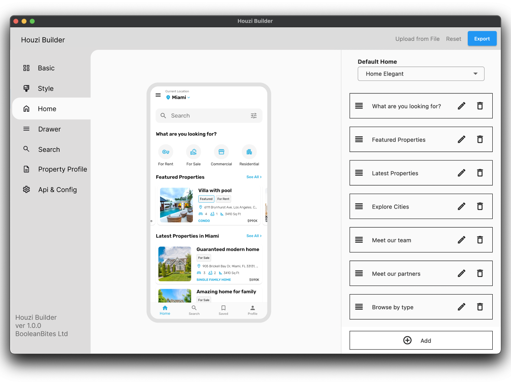

**Houzi Builder** is designed to generate **configuration file** for your app. The app is available for Windows and MacOS desktop. This documentation provides the guidance with ease to *generate* or *update/edit* the configuration file of the app.

